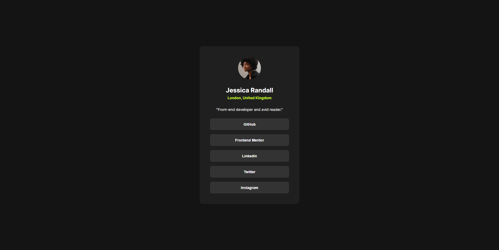

# Frontend Mentor - Social links profile solution

This is a solution to the [Social links profile challenge on Frontend Mentor](https://www.frontendmentor.io/challenges/social-links-profile-UG32l9m6dQ). Frontend Mentor challenges help you improve your coding skills by building realistic projects. 

## Table of contents

- [Frontend Mentor - Social links profile solution](#frontend-mentor---social-links-profile-solution)
  - [Table of contents](#table-of-contents)
  - [Overview](#overview)
    - [The challenge](#the-challenge)
    - [Screenshot](#screenshot)
    - [Links](#links)
  - [My process](#my-process)
    - [Built with](#built-with)
    - [What I learned](#what-i-learned)
      - [Example: Custom Button Component](#example-custom-button-component)
    - [Continued development](#continued-development)
    - [Useful resources](#useful-resources)
  - [Author](#author)
  - [Acknowledgments](#acknowledgments)

## Overview

### The challenge

Users should be able to:

- See hover and focus states for all interactive elements on the page

### Screenshot



### Links

- Solution URL: [https://github.com/jceballosdev/social-links-profile](https://github.com/jceballosdev/social-links-profile)
- Live Site URL: [https://social-links-profile-three-eta.vercel.app/](https://social-links-profile-three-eta.vercel.app/)

## My process

### Built with

- **Semantic HTML5** for clear and accessible markup
- **Sass** for modular and maintainable styling with variables, mixins, and nesting
- **CSS Flexbox** for responsive layout control
- **CSS Grid** for arranging layout where needed
- **Atomic Design principles** to build scalable components
- **React** and **TypeScript** for component-driven UI
- **Vite** for fast React and TypeScript development
- **Storybook** for component visualization and testing UI in isolation
- **Vitest** for unit and integration tests

### What I learned

In this project, I learned the importance of accessibility when creating interactive elements. Using Sass provided great flexibility and made it easy to handle variables, such as colors and spacing consistently. Setting up **Storybook** helped visualize components and handle styling and functionality in isolation.

#### Example: Custom Button Component

```tsx
export interface ButtonProps {
	link: SocialLink;
}

const Button: React.FC<ButtonProps> = ({ link }: ButtonProps): JSX.Element => {
	const openLink = () => {
		if (link.url) {
			window.open(link.url, '_blank');
		}
	};

	return (
		<button 
			className={styles.button} 
			onClick={() => openLink()}
			aria-label={`Open ${link.name} link in new tab`}
		>
			{link.name}
		</button>
	);
};
```

This button includes an ARIA label for accessibility, ensuring that screen readers and keyboard users understand the purpose of the button.

### Continued development

I plan to:

- Explore more advanced Sass features like conditionals and loops for large-scale styling
- Refine my testing strategy, possibly adding accessibility tests with Axe DevTools or similar
- Implement CI/CD practices to automate testing and deployment

### Useful resources

- [MDN Web Docs on ARIA](https://developer.mozilla.org/en-US/docs/Web/Accessibility/ARIA) - Great resource for learning about ARIA roles and attributes for accessible web applications.
- [Atomic Design by Brad Frost](https://atomicdesign.bradfrost.com/) - This post was foundational in understanding Atomic Design.
- [Vitest Documentation](https://vitest.dev/guide/) - Vitest’s documentation was essential for setting up and writing tests for each component.
- [Sass Documentation](https://sass-lang.com/documentation/) - Helped understand advanced Sass features.

## Author

- Website - [Juan Ceballos](https://github.com/jceballosdev)
- Frontend Mentor - [@jceballos29](https://www.frontendmentor.io/profile/jceballos29)

## Acknowledgments

Thanks to [Frontend Mentor](https://www.frontendmentor.io/) for these challenges that provide a great way to build real-world projects. Special thanks to the MDN community and Atomic Design for guiding my approach to component structure.